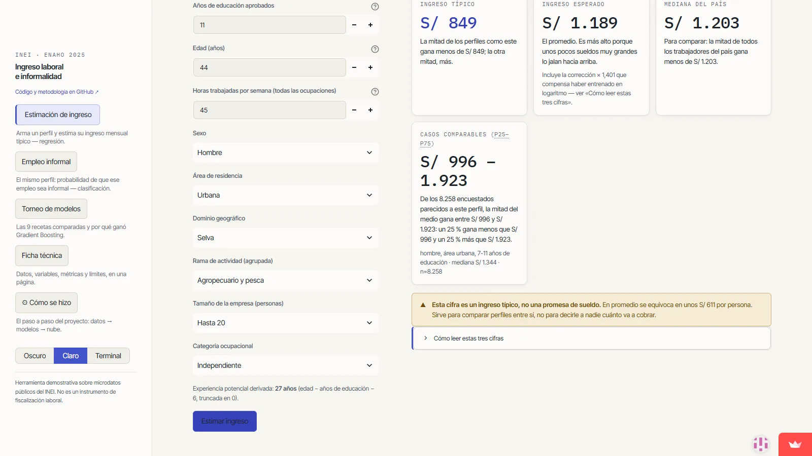

# Ingreso laboral e informalidad en el Perú — ENAHO 2025

> **Live demo / Demo en vivo:** https://enaho-ingresos-informalidad.streamlit.app
> **English UI:** https://enaho-ingresos-informalidad.streamlit.app/?lang=en · **Interfaz en español:** https://enaho-ingresos-informalidad.streamlit.app/?lang=es
> **Repo:** https://github.com/IchiSieben/enaho-ingresos-informalidad

**[English](#english) · [Español](#español)**

Two models deployed on Streamlit over Peru's 2025 National Household Survey
(ENAHO 2025, INEI) microdata: a **monthly labor income regressor** and an
**informal-employment classifier**. Status per the project's landing-page
listing: `live` / `usable`.

Dos modelos desplegados en Streamlit sobre los microdatos de la Encuesta
Nacional de Hogares (ENAHO 2025, INEI): un **regresor del ingreso laboral
mensual** y un **clasificador de empleo informal**. Estado según la ficha del
proyecto en el landing: `live` / `usable`.



---

## English

Two models deployed on Streamlit over the microdata of Peru's National
Household Survey (ENAHO 2025, INEI): a **monthly labor income regressor**
and an **informal-employment classifier**. Sibling project to another one in
**public health** (predicting adherence to clinical follow-up and cost of
care from open insurance-coverage data), built to the same standards: full
reproducibility (`random_state=42`), a form driven by `feature_schema.json`,
precomputed UI, thresholds chosen on out-of-fold probabilities, and declared
limitations.

What sets this project apart is that **it does not show only the winning
model: it shows the path**. An initial regression with implausible
coefficients exposed an error in the source data — INEI's missing-value code
read as real income — and became the first entry in a tournament of nine
specifications.

### 1. The autopsy: where all of this starts

An early regression the group ran on this data produced the following
equation (in levels):

```
INCOME = 653.35 + 11.47·urban + 6.39·male + 16.11·age
       + 691.92·primary + 1,386.35·secondary + 2,132.97·technical
       + 2,834.57·university + 18.76·hours + 6.98·members
```

+11 soles for living in an urban area and +6 for being male are
incompatible with the known gaps in Peru's labor market. **The problem was
not in how it was modeled, but in the data**: INEI codes "don't know" as
999999, and that code was being read as a real income of 999,999 soles —
something that deforms any regression on that base. Instead of discarding
the result it was **diagnosed**, reproducing the specification on the actual
microdata (`reports/00_autopsia_baseline.md`). Three causes, ordered by
damage:

| Cause | Measured evidence |
|---|---|
| **The 999999 sentinel.** INEI codes "don't know" as 999999 in monetary variables (documented in the dictionary). It affects 2.28% of the population through P530A (4.6% of self-employed earnings). | With the sentinel: R² 0.023, urban **−27,141**, technical **−12,959**. Sentinel → NaN: R² 0.248, urban **+235**, university **+2,201**. Every sign becomes plausible on a single change. |
| **Educational collinearity.** Years of schooling and detailed educational level are the same variable coded twice. | Together: VIF 15–20, and the dummies **flip sign** (secondary +588 → −761) without improving fit. They do not coexist in any specification. |
| **Levels vs log.** Income has skewness 3.98 (median S/ 750, p99 S/ 7,000). | The main family works on `log(income)` (Mincer) and returns to soles with Duan's (1983) smearing correction. |

The "welfare index" called for in the assignment turned out to be
**conceptual leakage**: its real counterpart (household income/expenditure)
contains individual income itself as one of its addends (ρ = 0.58, mechanical
circularity). Excluded from every model.

### 2. The tournament (same 80/20 split, same 5-fold CV, unweighted)

Selection by **cross-validation MAE** — choosing on test after comparing
nine specifications would mean selecting on the evaluation set. MAE in soles
with median-based inversion; the log specifications additionally report the
mean with Duan smearing (out-of-fold residuals from train).

| ID | Specification | CV MAE | Test MAE | Test R² (soles) | Interpretab. |
|---|---|---|---|---|---|
| **E9** | **Gradient Boosting (log) · deployed** | **610.9** | 610.8 | 0.420 | low |
| E8 | Random Forest (log) | 613.0 | 613.0 | 0.422 | low |
| E7 | Post-Lasso OLS (Belloni et al. 2014) | 686.9 | 686.9 | 0.262 | medium |
| E6 | Cleaned · **explanatory** | 690.1 | 691.2 | 0.273 | high |
| E4 | Extended Mincer | 729.3 | 733.6 | 0.250 | high |
| E3 | Classic Mincer (educ + exp + exp²) | 823.2 | 834.2 | 0.270 | high |
| E5 | Baseline replica (levels, sentinel now removed) | 830.3 | 837.1 | 0.243 | high |
| E2 | log(income) ~ years of schooling | 847.3 | 862.4 | 0.234 | high |
| E1 | Income ~ years of schooling (the assignment) | 900.6 | 906.4 | 0.172 | high |

Full detail (RMSE, R² on each model's own scale, smearing factors, VIF,
Breusch-Pagan, residual plots): `reports/torneo_regresion.md` and
`reports/comparacion_torneo.csv`.

**The gap is interpreted, not just reported**: E9 beats E6 by S/ 79 of MAE
(+11.5%). That difference estimates the contribution of the
non-linearities and interactions the linear functional form does not capture
(Athey & Imbens 2019). Note that no R² exceeds 0.5 in soles. For context:
the Mincer equation typically explains between 25% and 35% of the variance
of the **logarithm of the wage** — Mincer (1974), table 5.1: R² = 0.285;
Card (1999), table 1: 0.247–0.328 [1][3]. Neither Lemieux (2006) nor Heckman
et al. (2006) report an R², so they cannot be cited for this. And mind the
scale: E9's 0.42 is **in soles**, while those figures are **in logs** (this
tournament's Mincer, E3, gives 0.27). That values equal to or lower than
those are to be expected in a market with high informality is our reading,
not a published result.

#### The two readings

- **Predictive (E9, the one in the app):** test MAE S/ 611 against a median
  of S/ 1,101. The app shows the conditional median with the median/mean
  warning (smearing ×1.401) in the results panel.
- **Explanatory (E6 weighted with FAC500A, HC3 errors,
  `reports/modelo_explicativo.md`):** return to education **4.8%/year**;
  male **+43%**; urban **+32%**; self-employed **−50%**; firm of ≤20 people
  **−33%** (vs >500); mining **+74%** (vs commerce); Sierra Norte **−31%**
  (vs Metropolitan Lima). Consistent with the Peruvian literature on returns
  to education (Yamada).

#### Measured robustness: income in kind

The target is monetary only, but 24.6% of employed workers receive payment
in kind or self-consumption (concentrated in rural agriculture) — and
excluding it could inflate precisely the urban coefficient that carries the
narrative. It was measured: urban premium 54.6% (monetary only) vs 52.0%
(with in-kind). The exclusion is **validated as robust and declared**, not
hidden.

### 3. The informal-employment classifier

`OCUPINF` does not ship with the 2025 release, so the target was **derived**
using INEI's operational rule: self-employed workers and employers →
informal if the unit is not registered with SUNAT (P510A1=3); wage earners →
informal if not affiliated to any pension system (P558A5=5).

**External validation of the derivation** (using the FAC500A expansion
factor):

| Contrast | Derived | Official INEI 2025 |
|---|---|---|
| National (all employed, unpaid family workers included) | 67.3% | 70.2% |
| Urban | 61.3% | 64.5% |
| Rural | 91.6% | 94.8% |

A uniform bias of ~3 points, and explainable: pension affiliation includes
self-financed affiliations. The model's firm-size gradient also runs in the
same direction as the official pattern: INEI reports 88.6% informality in
firms of **1 to 10 workers** and 15.6% in those with more than 50 [11]. That
publication's brackets are not this project's (here, "Up to 20" gives 81.1%
weighted), so what matches is the direction and magnitude of the gradient,
not each individual figure.

**Benchmark** (selection by cross-validation PR-AUC; baseline = prevalence
0.678):

| Algorithm | CV PR-AUC | CV ROC-AUC | Test PR-AUC | Brier |
|---|---|---|---|---|
| **Gradient Boosting · deployed** | **0.9626** | 0.9289 | 0.9605 | 0.097 |
| Random Forest | 0.9619 | 0.9279 | 0.9589 | 0.098 |
| Logistic regression (baseline) | 0.9553 | 0.9164 | 0.9526 | 0.105 |

The logistic model is the obligatory reference point, and its odds ratios
tell the known story of the Peruvian market: firm of ≤20 people **OR 16.7**,
self-employed OR 5.2, urban OR 0.56, each year of education OR 0.82
(`reports/clasificador_informalidad.md`).

**Operating point** (chosen on out-of-fold probabilities from train, never
on test): **precision ≥ 0.90 for the informal class**, threshold 0.605 →
recall 0.893, lift 1.33×. The honest number for the presentation: *of every
1,000 workers flagged, 900 are actually informal, against 678 if they were
flagged at random.* Test confirms the point (0.900 / 0.893).

**Framing — read this before being impressed by the PR-AUC:** the
classifier is NOT a forward-looking prediction tool. Informality is
determined by the configuration of the job (firm size, occupational
category, industry), which is known at the same time as the status itself.
Its usefulness is **targeting**: identifying segments where formalization
programs should be concentrated, starting from variables observable in
administrative records, without verifying pension affiliation case by case.
The **structural ablation** bounds it: without firm size, PR-AUC 0.957;
without size or category, 0.942 — education, area, industry and hours carry
the remaining signal. `categoria` (P507) additionally **branches the target
definition itself** (self-employed→RUC, wage earner→pensions): its high
importance is by construction, not a finding.

### 4. Declared design decisions

- **Weighting.** The tournament and training run **unweighted** (they are
  comparison and in-sample predictive accuracy); the descriptives,
  prevalences, cohort medians in the app and the explanatory model run
  **weighted with FAC500A** (population reading). Each table declares which
  one it is. Technical detail: FAC500A arrives with a **decimal comma** in
  INEI's CSV.
- **Income target.** Sum of INEI's imputed/deflated/**annualized** versions
  (I524A1, I530A, I538A1, I541A) ÷ 12: a **smoothed** income, not the
  reference month's, and free of the sentinel and of P524A1's periodicity
  trap (it is the "amount of the last payment", not a monthly figure).
- **Hours.** P520 is only asked for atypical weeks (~10% coverage); I513T +
  I518 are used instead (main + secondary jobs, 100% coverage).
- **Population.** Employed aged 14+ with income > 0 (47,899 after a
  documented cascade). The 6,500 unpaid family workers fall outside because
  their income is zero — a population restriction, not an error.
- **Anti-circularity.** Barred as classifier predictors: the columns that
  define the target (P510A1, P510B, P558A*, P517B1) and P511A (contract,
  univariate AUC 0.846 — almost definitional for wage earners). Income is
  not a predictor of informality either.
- **Potential experience** = age − years of schooling − 6, truncated at 0
  (0.2% negative). At low education levels it overestimates actual
  experience (Heckman, Lochner & Todd 2006). The app derives it; the user
  does not type it in.

#### A quality note on the course material

The file `INEI_ENAHO_500registrosML_inicialsol1.xlsx` distributed as the
initial input is a **synthetic practice dataset**: fake national ID numbers,
children aged 2 and 10 with incomes of thousands of soles, and inconsistent
labor-force/employed states. It was not used. This entire project —
including the baseline replica — runs on the **real microdata** of ENAHO
2025 downloaded from INEI (the same discipline as in the sibling public
health project).

### 5. Reproduction

Execution verified on Windows with Python 3.12.10: the `pip install` of
every pinned version (including the unusual ones, `pandas==3.0.5` and
`pyarrow==24.0.0`) resolved with no conflicts, and
`streamlit run app/streamlit_app.py` came up and answered `HTTP 200` using
only the artifacts versioned in `models/` — **without needing the raw
microdata**, which is only required to reproduce the training pipeline
(the steps that follow):

```
python -m venv .venv && .venv\Scripts\pip install -r requirements.txt
# place ENAHO 2025 (survey 1031) modules 02, 03 and 05 in data/raw/
.venv\Scripts\python src/00_extraer_diccionario.py
.venv\Scripts\python src/00_inventario.py
.venv\Scripts\python src/01_fase0_poblacion.py
.venv\Scripts\python src/02_fase0_autopsia.py
.venv\Scripts\python src/03_fase1_preparacion.py
.venv\Scripts\python src/04_torneo_regresion.py
.venv\Scripts\python src/05_modelo_explicativo.py
.venv\Scripts\python src/06_entrenar_clasificador.py
.venv\Scripts\python src/07_guardar_regresor.py
.venv\Scripts\python src/08_ablacion_clasificador.py
.venv\Scripts\python src/09_precomputar_ui.py
streamlit run app/streamlit_app.py
```

The microdata is **not redistributed** in this repository (`data/` is in
`.gitignore`); it is downloaded from INEI's public microdata
(https://proyectos.inei.gob.pe/microdatos/, ENAHO 2025, survey 1031, modules
02, 03 and 05).

### 6. Documentation

- [User manual](docs/manual_usuario.md) — for someone opening the app
  without knowing the project: what it is (and what it is not), how to fill
  in the form, how to read each output, and frequently asked questions.
- [Architecture](docs/arquitectura.md) — for developers: the full flow with
  a diagram, a file-by-file map, the design decisions with their rationale,
  how to reproduce everything, and how a new variable would be added.
- [Guide to interpreting the metrics](docs/interpretacion_metricas.md) —
  every metric in the project (MAE, R², smearing, PR-AUC, calibration, odds
  ratios, VIF…) with what it is, how it is computed here, the value
  obtained, how to read it, and what is reasonable to expect according to
  the literature.
- [Presentation script](docs/guion_exposicion.md) — the narrative in three
  acts for a 10–15 minute presentation, the numbers to keep at hand, and
  the anticipated questions with their answers.
- [Tournament methodology](docs/METODOLOGIA_TORNEO.md) — what varies between
  E1 and E9, the verification that all nine were compared on the same sample
  and the same folds, the hyperparameter grids with their re-optimization,
  E7's Lasso, and the stability of variable importance.
- [Audit report](INFORME_AUDITORIA.md) — internal review of the repository:
  findings classified by severity, the data funnel with the N at each step,
  the sentinel sweep, the reconciliation of the informality rate against
  INEI, and the list of what was left unverified.

### 7. What you can reuse

| Part | Licence | Condition |
|---|---|---|
| Code (`src/`, `app/`, `run.ps1`) and `models/` artifacts | [Apache-2.0](LICENSE) | Derivatives must state their changes and retain the contents of [`NOTICE`](NOTICE) (section 4d). |
| Documentation, `reports/*.md` and figures | [CC BY-NC 4.0](docs/LICENSE-DOCS.md) | Attribution required; no commercial use. |
| ENAHO 2025 microdata | INEI's, **not redistributed here** | Download from the [official source](https://proyectos.inei.gob.pe/microdatos/) under its own terms of use. |

To cite the project, GitHub generates the citation from
[`CITATION.cff`](CITATION.cff) ("Cite this repository" button).

### 8. Credits

Project produced within the **Machine Learning** course at the **ENEI**
(Escuela Nacional de Estadística e Informática, INEI), with instructor
**Orlando Advíncula Zeballos**. Group: **Alan Nestor Cañazaca Mamani**,
**Magdalena Quico de la Cruz**, **Yoichi Palacios Tanaka** and **Edgar
Delgado Ortega**. Detailed authorship and CRediT roles in
[`AUTHORS.md`](AUTHORS.md).

**Author (citable software):** Yoichi Palacios Tanaka (IchiSieben) ·
ichisieben.dev

### 9. Bibliographic framework

- Mincer, J. (1974). *Schooling, Experience, and Earnings*. NBER. — E3 is
  literally this equation.
- Heckman, J., Lochner, L. & Todd, P. (2006). "Earnings Functions, Rates of
  Return and Treatment Effects: The Mincer Equation and Beyond". *Handbook of
  the Economics of Education*. — Why exp and exp², and the limits of
  potential experience.
- Lemieux, T. (2006). "The 'Mincer Equation' Thirty Years After". — How the
  specification holds up, and its extensions.
- Duan, N. (1983). "Smearing Estimate: A Nonparametric Retransformation
  Method". *JASA* 78(383). — The tournament's retransformation correction.
- Athey, S. & Imbens, G. (2019). "Machine Learning Methods That Economists
  Should Know About". *Annual Review of Economics* 11. — The framework for
  reading the OLS vs trees gap.
- Belloni, A., Chernozhukov, V. & Hansen, C. (2014). "High-Dimensional
  Methods and Inference on Structural and Treatment Effects". *JEP* 28(2). —
  The grounding (and the cautions) for post-Lasso (E7).
- Sohnesen, T. P. & Stender, N. (2016). "Is Random Forest a Superior
  Methodology for Predicting Poverty? An Empirical Assessment". World Bank
  Policy Research WP **7612** (7970 is a different paper). — ML vs
  regression benchmark on household surveys.
- Yamada, G. (2007). *Retornos a la educación superior en el mercado laboral:
  ¿vale la pena el esfuerzo?* CIES / U. del Pacífico. — Returns by segment in
  Peru: 12.5% a year for wage earners against 6.5% for the self-employed
  (2004), the gap this project finds again.
- INEI — ENAHO 2025 technical sheet and dictionary; 2025 technical reports on
  employment and informality (prevalence contrast).

### Status / maturity

Per the landing-page listing (`Landing/src/content/projects/{es,en}/predictor-ingresos.md`):
`status: live`, `maturity: usable`, tier A. Next declared steps: ship a
standalone HTML page with a Streamlit `?embed=true` iframe, retest cold-start
behavior after long idle periods, and publish the explanatory model's
weighted coefficients as a second view.

---

## Español

Dos modelos desplegados en Streamlit sobre los microdatos de la Encuesta
Nacional de Hogares (ENAHO 2025, INEI): un **regresor del ingreso laboral
mensual** y un **clasificador de empleo informal**. Proyecto hermano de otro
de **salud pública** (predicción de adherencia al seguimiento clínico y costo
de atención con datos abiertos de aseguramiento), con los mismos estándares: reproducibilidad total
(`random_state=42`), formulario dirigido por `feature_schema.json`,
precómputo de UI, umbrales elegidos sobre probabilidades out-of-fold y
limitaciones declaradas.

La diferencia de este proyecto es que **no muestra solo el modelo ganador:
muestra el camino**. Una regresión inicial con coeficientes implausibles
destapó un error en los datos de origen —el código de faltante del INEI leído
como un ingreso real— y se convirtió en la primera pieza de un torneo de
nueve especificaciones.

### 1. La autopsia: de dónde parte todo

Una primera regresión del grupo sobre estos datos produjo esta ecuación (en
niveles):

```
INGRESO = 653,35 + 11,47·urbano + 6,39·hombre + 16,11·edad
        + 691,92·primaria + 1.386,35·secundaria + 2.132,97·tecnica
        + 2.834,57·universitaria + 18,76·horas + 6,98·miembros
```

+11 soles por residir en zona urbana y +6 por ser hombre son incompatibles
con las brechas conocidas del mercado laboral peruano. **El problema no
estaba en cómo se modeló, sino en los datos**: el INEI codifica «no sabe»
como 999999 y ese código se leía como un ingreso real de 999.999 soles, algo
que deforma cualquier regresión sobre esa base. En vez de descartar el
resultado se **diagnosticó**, reproduciendo la especificación sobre los
microdatos reales (`reports/00_autopsia_baseline.md`). Tres causas, por orden
de daño:

| Causa | Evidencia medida |
|---|---|
| **El centinela 999999.** El INEI codifica «no sabe» como 999999 en variables monetarias (documentado en el diccionario). Afecta al 2,28 % de la población vía P530A (4,6 % de las ganancias de independientes). | Con centinela: R² 0,023, urbano **−27.141**, técnica **−12.959**. Centinela → NaN: R² 0,248, urbano **+235**, universitaria **+2.201**. Todos los signos se vuelven plausibles con un solo cambio. |
| **Colinealidad educativa.** Años de educación y nivel educativo detallado son la misma variable codificada dos veces. | Juntos: VIF 15–20 y las dummies **cambian de signo** (secundaria +588 → −761) sin mejorar el ajuste. No conviven en ninguna especificación. |
| **Niveles vs log.** El ingreso tiene asimetría 3,98 (mediana S/ 750, p99 S/ 7.000). | La familia principal trabaja en `log(ingreso)` (Mincer) y vuelve a soles con la corrección de smearing de Duan (1983). |

El «índice de bienestar» de la consigna resultó ser **leakage conceptual**:
su contraparte real (ingreso/gasto del hogar) contiene al propio ingreso
individual como sumando (ρ = 0,58, circularidad mecánica). Excluido de todo
modelo.

### 2. El torneo (mismo split 80/20, misma CV de 5 pliegues, sin ponderar)

Selección por **MAE de validación cruzada** — elegir por test tras comparar
nueve especificaciones sería seleccionar sobre el conjunto de evaluación.
MAE en soles con inversión por mediana; las especificaciones en log reportan
además la media con smearing de Duan (residuos out-of-fold de train).

| ID | Especificación | MAE cv | MAE test | R² test (soles) | Interpretab. |
|---|---|---|---|---|---|
| **E9** | **Gradient Boosting (log) · desplegada** | **610,9** | 610,8 | 0,420 | baja |
| E8 | Random Forest (log) | 613,0 | 613,0 | 0,422 | baja |
| E7 | Post-Lasso OLS (Belloni et al. 2014) | 686,9 | 686,9 | 0,262 | media |
| E6 | Depurada · **explicativa** | 690,1 | 691,2 | 0,273 | alta |
| E4 | Mincer extendido | 729,3 | 733,6 | 0,250 | alta |
| E3 | Mincer clásico (educ + exp + exp²) | 823,2 | 834,2 | 0,270 | alta |
| E5 | Réplica del baseline (niveles, ya sin centinela) | 830,3 | 837,1 | 0,243 | alta |
| E2 | log(ingreso) ~ años educación | 847,3 | 862,4 | 0,234 | alta |
| E1 | Ingreso ~ años educación (consigna) | 900,6 | 906,4 | 0,172 | alta |

Detalle completo (RMSE, R² en escala propia, factores de smearing, VIF,
Breusch-Pagan, gráficos de residuos): `reports/torneo_regresion.md` y
`reports/comparacion_torneo.csv`.

**La brecha se interpreta, no solo se reporta**: E9 mejora a E6 en S/ 79 de
MAE (+11,5 %). Esa diferencia estima el aporte de las no linealidades e
interacciones que la forma funcional lineal no captura (Athey & Imbens 2019).
Nótese que ningún R² supera 0,5 en soles. Para situarlo: la ecuación de
Mincer explica típicamente entre un 25 % y un 35 % de la varianza del
**logaritmo del salario** — Mincer (1974), cuadro 5.1: R² = 0,285; Card
(1999), cuadro 1: 0,247–0,328 [1][3]. Ni Lemieux (2006) ni Heckman et al.
(2006) reportan un R², así que no se les puede citar para esto. Y ojo con la
escala: el 0,42 de E9 está **en soles**, mientras que esas cifras están **en
logaritmo** (la Mincer de este torneo, E3, da 0,27). Que en un mercado con
alta informalidad quepa esperar valores iguales o menores es lectura nuestra,
no un resultado publicado.

#### Las dos lecturas

- **Predictiva (E9, en la app):** MAE test S/ 611 sobre una mediana de
  S/ 1.101. La app muestra la mediana condicional con la advertencia
  mediana/media (smearing ×1,401) en el panel de resultado.
- **Explicativa (E6 ponderada con FAC500A, errores HC3,
  `reports/modelo_explicativo.md`):** retorno a la educación **4,8 %/año**;
  hombre **+43 %**; urbano **+32 %**; independiente **−50 %**; empresa ≤20
  personas **−33 %** (vs >500); minería **+74 %** (vs comercio); Sierra Norte
  **−31 %** (vs Lima Metropolitana). Coherente con la literatura peruana de
  retornos a la educación (Yamada).

#### Robustez medida: el ingreso en especie

El target es solo monetario, pero el 24,6 % de los ocupados recibe pago en
especie o autoconsumo (concentrado en el agro rural) — y su exclusión podría
inflar justo el coeficiente urbano que protagoniza la narrativa. Se midió:
premio urbano 54,6 % (solo monetario) vs 52,0 % (con especie). La exclusión
queda **validada como robusta y declarada**, no escondida.

### 3. El clasificador de empleo informal

`OCUPINF` no viene en la entrega 2025, así que el target se **derivó** con la
regla operativa del INEI: independientes y empleadores → informal si la
unidad no está registrada en SUNAT (P510A1=3); dependientes → informal si no
están afiliados a ningún sistema de pensiones (P558A5=5).

**Validación externa de la derivación** (con factor de expansión FAC500A):

| Contraste | Derivada | Oficial INEI 2025 |
|---|---|---|
| Nacional (todos los ocupados, TFNR incluidos) | 67,3 % | 70,2 % |
| Urbano | 61,3 % | 64,5 % |
| Rural | 91,6 % | 94,8 % |

Sesgo uniforme de ~3 pts, explicable: la afiliación a pensiones incluye
afiliaciones autofinanciadas. Además, el gradiente por tamaño de empresa del
modelo va en el mismo sentido que el patrón oficial: el INEI reporta 88,6 %
de informalidad en empresas de **1 a 10 trabajadores** y 15,6 % en las de más
de 50 [11]. Los tramos de esa publicación no son los de este proyecto (aquí,
«Hasta 20» da 81,1 % ponderado), así que lo que coincide es la dirección y la
magnitud del gradiente, no cada cifra.

**Benchmark** (selección por PR-AUC de validación cruzada; baseline =
prevalencia 0,678):

| Algoritmo | PR-AUC cv | ROC-AUC cv | PR-AUC test | Brier |
|---|---|---|---|---|
| **Gradient Boosting · desplegado** | **0,9626** | 0,9289 | 0,9605 | 0,097 |
| Random Forest | 0,9619 | 0,9279 | 0,9589 | 0,098 |
| Regresión logística (baseline) | 0,9553 | 0,9164 | 0,9526 | 0,105 |

La logística es el punto de referencia obligado y sus odds ratios cuentan la
historia conocida del mercado peruano: empresa ≤20 personas **OR 16,7**,
independiente OR 5,2, urbano OR 0,56, cada año de educación OR 0,82
(`reports/clasificador_informalidad.md`).

**Punto operativo** (elegido sobre probabilidades out-of-fold de train,
nunca sobre test): **precisión ≥ 0,90 para la clase informal**, umbral 0,605
→ recall 0,893, lift 1,33×. El número honesto para la exposición: *de cada
1.000 trabajadores señalados, 900 son efectivamente informales, frente a 678
si se señalara al azar.* El test confirma el punto (0,900 / 0,893).

**Encuadre — léase antes de impresionarse por el PR-AUC:** el clasificador
NO es una herramienta de predicción a futuro. La informalidad se determina
por la configuración del empleo (tamaño de empresa, categoría ocupacional,
rama), que se conoce al mismo tiempo que el estatus. Su utilidad es de
**focalización**: identificar segmentos donde concentrar programas de
formalización a partir de variables observables en registros administrativos,
sin verificar caso por caso la afiliación a pensiones. La **ablación
estructural** lo acota: sin tamaño de empresa, PR-AUC 0,957; sin tamaño ni
categoría, 0,942 — educación, área, rama y horas sostienen la señal restante.
`categoria` (P507) además **ramifica la propia definición del target**
(independiente→RUC, dependiente→pensiones): su importancia alta es por
construcción, no un hallazgo.

### 4. Decisiones de diseño declaradas

- **Ponderación.** El torneo y el entrenamiento van **sin ponderar** (son
  comparación y precisión predictiva intramuestral); los descriptivos,
  prevalencias, medianas de cohorte de la app y el modelo explicativo van
  **ponderados con FAC500A** (lectura poblacional). Cada tabla declara cuál es.
  Detalle técnico: FAC500A viene con **coma decimal** en el CSV del INEI.
- **Target de ingreso.** Suma de las versiones imputadas/deflactadas/
  **anualizadas** del INEI (I524A1, I530A, I538A1, I541A) ÷ 12: un ingreso
  **suavizado**, no el del mes de referencia, y libre del centinela y de la
  trampa de periodicidad de P524A1 (que es «monto del último pago», no mensual).
- **Horas.** P520 solo se pregunta en semanas atípicas (cobertura ~10 %);
  se usa I513T + I518 (principal + secundarias, cobertura 100 %).
- **Población.** Ocupados 14+ con ingreso > 0 (47.899 tras cascada
  documentada). Los 6.500 TFNR quedan fuera por ingreso nulo — restricción de
  población, no error.
- **Anti-circularidad.** Prohibidas como predictoras del clasificador las
  columnas que definen el target (P510A1, P510B, P558A*, P517B1) y P511A
  (contrato, AUC univariado 0,846 — casi definicional para asalariados). El
  ingreso tampoco es predictor de la informalidad.
- **Experiencia potencial** = edad − años educación − 6, truncada en 0
  (0,2 % de negativos). En baja educación sobreestima la experiencia real
  (Heckman, Lochner & Todd 2006). La app la deriva; el usuario no la digita.

#### Nota de calidad sobre el material del curso

El archivo `INEI_ENAHO_500registrosML_inicialsol1.xlsx` distribuido como
insumo inicial es un **dataset sintético de práctica**: DNIs falsos,
menores de 2 y 10 años con ingresos de miles de soles, y estados
PEA/ocupado inconsistentes. No se usó. Todo este proyecto — incluida la
réplica del baseline — corre sobre los **microdatos reales** de la ENAHO
2025 descargados del INEI (la misma disciplina que en el proyecto hermano de
salud pública).

### 5. Reproducción

Ejecución verificada en Windows con Python 3.12.10: el `pip install` de
todas las versiones fijadas (incluidas las inusuales, `pandas==3.0.5` y
`pyarrow==24.0.0`) resolvió sin conflictos, y `streamlit run app/streamlit_app.py`
levantó y respondió `HTTP 200` usando solo los artefactos versionados en
`models/` — **sin necesitar los microdatos crudos**, que solo hacen falta
para reproducir el pipeline de entrenamiento (pasos siguientes):

```
python -m venv .venv && .venv\Scripts\pip install -r requirements.txt
# colocar los módulos 02, 03 y 05 de la ENAHO 2025 (encuesta 1031) en data/raw/
.venv\Scripts\python src/00_extraer_diccionario.py
.venv\Scripts\python src/00_inventario.py
.venv\Scripts\python src/01_fase0_poblacion.py
.venv\Scripts\python src/02_fase0_autopsia.py
.venv\Scripts\python src/03_fase1_preparacion.py
.venv\Scripts\python src/04_torneo_regresion.py
.venv\Scripts\python src/05_modelo_explicativo.py
.venv\Scripts\python src/06_entrenar_clasificador.py
.venv\Scripts\python src/07_guardar_regresor.py
.venv\Scripts\python src/08_ablacion_clasificador.py
.venv\Scripts\python src/09_precomputar_ui.py
streamlit run app/streamlit_app.py
```

Los microdatos **no se redistribuyen** en este repositorio (`data/` está en
`.gitignore`); se descargan de los microdatos públicos del INEI
(https://proyectos.inei.gob.pe/microdatos/, ENAHO 2025, encuesta 1031,
módulos 02, 03 y 05).

### 6. Documentación

- [Manual de usuario](docs/manual_usuario.md) — para quien abre la app sin
  conocer el proyecto: qué es (y qué no), cómo llenar el formulario, cómo
  leer cada salida y preguntas frecuentes.
- [Arquitectura](docs/arquitectura.md) — para desarrolladores: el flujo
  completo con diagrama, mapa archivo por archivo, las decisiones de diseño
  con su porqué, cómo reproducir todo y cómo se agregaría una variable nueva.
- [Guía de interpretación de métricas](docs/interpretacion_metricas.md) —
  cada métrica del proyecto (MAE, R², smearing, PR-AUC, calibración, odds
  ratios, VIF…) con qué es, cómo se calcula aquí, el valor obtenido, cómo
  leerlo y qué es razonable esperar según la literatura.
- [Guion de exposición](docs/guion_exposicion.md) — la narrativa en tres
  actos para presentar en 10–15 minutos, los números para tener a mano y las
  preguntas anticipadas con respuesta.
- [Metodología del torneo](docs/METODOLOGIA_TORNEO.md) — qué varía entre E1
  y E9, la verificación de que las nueve se compararon sobre la misma
  muestra y los mismos pliegues, las rejillas de hiperparámetros con su
  re-optimización, el Lasso de E7 y la estabilidad de la importancia de
  variables.
- [Informe de auditoría](INFORME_AUDITORIA.md) — revisión interna del
  repositorio: hallazgos clasificados por severidad, el embudo de datos con
  el N de cada paso, el barrido de centinelas, la reconciliación de la tasa
  de informalidad con el INEI y la lista de lo que quedó sin verificar.

### 7. Qué puedes reutilizar

| Parte | Licencia | Condición |
|---|---|---|
| Código (`src/`, `app/`, `run.ps1`) y artefactos de `models/` | [Apache-2.0](LICENSE) | Los derivados deben declarar los cambios y conservar el contenido de [`NOTICE`](NOTICE) (sección 4d). |
| Documentación, `reports/*.md` y figuras | [CC BY-NC 4.0](docs/LICENSE-DOCS.md) | Atribución obligatoria; sin uso comercial. |
| Microdatos ENAHO 2025 | Del INEI, **no se redistribuyen aquí** | Descarga de la [fuente oficial](https://proyectos.inei.gob.pe/microdatos/) bajo sus términos de uso. |

Para citar el proyecto, GitHub genera la cita desde [`CITATION.cff`](CITATION.cff)
(botón «Cite this repository»).

### 8. Créditos

Proyecto elaborado en el marco del curso de **Machine Learning** de la
**ENEI** (Escuela Nacional de Estadística e Informática, INEI), con el
docente **Orlando Advíncula Zeballos**. Grupo: **Alan Nestor Cañazaca
Mamani**, **Magdalena Quico de la Cruz**, **Yoichi Palacios Tanaka** y
**Edgar Delgado Ortega**. Autoría detallada y roles CRediT en
[`AUTHORS.md`](AUTHORS.md).

**Autor (software citable):** Yoichi Palacios Tanaka (IchiSieben) ·
ichisieben.dev

### 9. Marco bibliográfico

- Mincer, J. (1974). *Schooling, Experience, and Earnings*. NBER. — E3 es
  literalmente esta ecuación.
- Heckman, J., Lochner, L. & Todd, P. (2006). "Earnings Functions, Rates of
  Return and Treatment Effects: The Mincer Equation and Beyond". *Handbook of
  the Economics of Education*. — Por qué exp y exp², y los límites de la
  experiencia potencial.
- Lemieux, T. (2006). "The 'Mincer Equation' Thirty Years After". — Vigencia
  y extensiones de la especificación.
- Duan, N. (1983). "Smearing Estimate: A Nonparametric Retransformation
  Method". *JASA* 78(383). — La corrección de retransformación del torneo.
- Athey, S. & Imbens, G. (2019). "Machine Learning Methods That Economists
  Should Know About". *Annual Review of Economics* 11. — El marco para leer
  la brecha OLS vs árboles.
- Belloni, A., Chernozhukov, V. & Hansen, C. (2014). "High-Dimensional
  Methods and Inference on Structural and Treatment Effects". *JEP* 28(2). —
  El sustento (y las cautelas) del post-Lasso (E7).
- Sohnesen, T. P. & Stender, N. (2016). "Is Random Forest a Superior
  Methodology for Predicting Poverty? An Empirical Assessment". World Bank
  Policy Research WP **7612** (el 7970 es otro paper). — Benchmark
  ML vs regresión en encuestas de hogares.
- Yamada, G. (2007). *Retornos a la educación superior en el mercado laboral:
  ¿vale la pena el esfuerzo?* CIES / U. del Pacífico. — Retornos por segmento
  en Perú: 12,5 % anual para asalariados frente a 6,5 % para independientes
  (2004), la brecha que este proyecto vuelve a encontrar.
- INEI — Ficha técnica y diccionario de la ENAHO 2025; informes técnicos de
  empleo e informalidad 2025 (contraste de prevalencias).

### Estado / madurez

Según la ficha del proyecto en el landing (`Landing/src/content/projects/{es,en}/predictor-ingresos.md`):
`status: live`, `maturity: usable`, tier A. Próximos pasos declarados:
publicar una página HTML propia con un iframe de Streamlit `?embed=true`,
volver a probar el arranque en frío tras periodos largos de inactividad, y
publicar los coeficientes ponderados del modelo explicativo como segunda
vista.

---

*Demonstration tool, for academic purposes, built on public microdata. It is
not a labor-enforcement instrument and it does not certify any person's
situation.*

*Herramienta demostrativa con fines académicos sobre microdatos públicos.
No es un instrumento de fiscalización laboral ni certifica la situación de
ninguna persona.*
