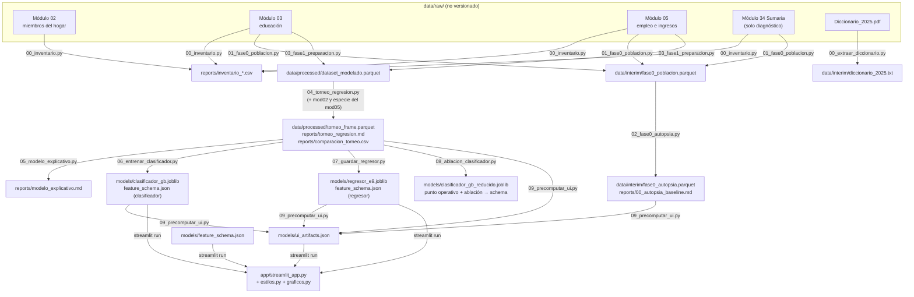

# Arquitectura del proyecto

Documento para desarrolladores — incluido el autor dentro de seis meses.
Describe el flujo completo de datos, qué hace cada archivo, por qué se
tomaron las decisiones de diseño y cómo reproducir o extender el proyecto.

---

## 1. El flujo completo



Dos artefactos JSON son el **contrato** entre el entrenamiento y la app:

- `models/feature_schema.json` — qué variables existen, sus rangos, opciones,
  defaults, etiquetas y notas; más las métricas de test, el punto operativo
  del clasificador y la ablación. Lo escriben los scripts 06, 07 y 08 por
  secciones (`guardar_schema` actualiza una clave sin pisar las otras).
- `models/ui_artifacts.json` — todo lo caro ya calculado: curva de umbral,
  ROC/PR/calibración, dependencia parcial, importancia por permutación,
  percentiles de cohorte, comparables y la narrativa del torneo. Lo escribe
  el script 09.

La app **no contiene ningún número escrito a mano**: todo lo visible sale de
esos dos archivos o de los `.joblib`.

## 2. Mapa archivo por archivo

### `src/`

| Archivo | Qué hace | Qué produce |
|---|---|---|
| `comun.py` | Utilidades compartidas (adaptadas del proyecto SIS-diabetes): constantes de dominio (centinelas, llaves, mapas de códigos), lector de CSV del INEI (`sep=";"`, latin-1, llaves como texto), recodificación de años de educación, agrupación de ramas CIIU, preprocesador (`ColumnTransformer` con imputación de mediana + `StandardScaler` + `OneHotEncoder` con colapso de categorías raras a «OTROS», umbral 300 obs.), extracción del contrato de features desde el pipeline ajustado, caché de hiperparámetros, escritura atómica de JSON (tmp + `os.replace`), guardado con límite de tamaño y formateo Markdown. | — |
| `00_extraer_diccionario.py` | Extrae el texto del `Diccionario_2025.pdf` (381 páginas) para consultarlo con grep. | `data/interim/diccionario_2025.txt` |
| `00_inventario.py` | Inventario por columna de los 6 módulos: dtype, únicos, % de nulos antes y después de convertir el centinela 999999 — la diferencia mide el problema. | `reports/inventario_columnas.csv`, `reports/inventario_modulos.csv` |
| `01_fase0_poblacion.py` | Verificación empírica sobre archivos completos: códigos de OCU500, magnitud del centinela por variable monetaria, candidatas de ingreso, cascada de población (84.853 → 57.716 → 47.899) y merges con educación y Sumaria. | `data/interim/fase0_poblacion.parquet` |
| `02_fase0_autopsia.py` | Reproduce la regresión inicial del curso en dos corridas (centinela sin limpiar vs → NaN), diagnostica la colinealidad educación años/niveles (VIF) y la circularidad del «índice de bienestar» (INGHOG2D, GASHOG2D, POBREZA). | `data/interim/fase0_autopsia.parquet` (y la base de `reports/00_autopsia_baseline.md`) |
| `03_fase1_preparacion.py` | Construye el dataset de modelado: targets (`ingreso_mes` = suma de anualizados INEI/12; `informal` = regla derivada), horas totales (principal + secundaria), derivadas Mincer, mapeos de códigos a etiquetas, validación externa de la prevalencia contra el INEI y AUC univariado anti-circularidad. Convierte FAC500A de coma decimal. | `data/processed/dataset_modelado.parquet`, `reports/01_preparacion_fase1.md` |
| `04_torneo_regresion.py` | El torneo E1–E9 con protocolo único: split 80/20 y KFold(5) compartidos, MAE de validación cruzada como criterio de selección, smearing de Duan con residuos out-of-fold de train, inferencia OLS (HC3, VIF, Breusch-Pagan) y figuras de residuos para E1–E6, Lasso/post-Lasso (E7), RF/GB con grilla cacheada (E8/E9), sensibilidad al ingreso en especie. | `reports/torneo_regresion.md`, `reports/comparacion_torneo.csv`, `data/processed/torneo_frame.parquet`, `data/processed/indices_test.csv`, figuras `02_ols_E*.png` |
| `05_modelo_explicativo.py` | E4 y E6 reestimadas como WLS ponderadas con FAC500A y errores HC3: la lectura poblacional de los coeficientes, deliberadamente separada del torneo. | `reports/modelo_explicativo.md` |
| `06_entrenar_clasificador.py` | Clasificador de informalidad: logística baseline con odds ratios, RF y GB con grilla cacheada, selección por PR-AUC de CV, puntos operativos sobre probabilidades out-of-fold, importancia por permutación, figuras. Escribe la sección `clasificador` del schema. | `models/clasificador_gb.joblib`, `reports/clasificador_informalidad.md`, `reports/comparacion_clasificador.csv`, figuras |
| `07_guardar_regresor.py` | Refit del E9 ganador con los hiperparámetros cacheados, cálculo del factor de smearing (OOF de train) y guardado del artefacto + sección `regresor` del schema. | `models/regresor_e9.joblib` |
| `08_ablacion_clasificador.py` | Ablación estructural (sin `tamano_empresa`; sin `tamano_empresa` ni `categoria`) con protocolo idéntico; guarda la variante reducida y fija en el schema el punto operativo aprobado, la ablación y el encuadre. | `models/clasificador_gb_reducido.joblib`, `reports/ablacion_clasificador.csv`, actualiza `feature_schema.json` |
| `09_precomputar_ui.py` | Precomputa todo lo que la app muestra: curva de umbral (sumas acumuladas sobre OOF), ROC/PR/calibración/histograma en test, dependencia parcial, importancia por permutación, cohortes y comparables ponderados, y la narrativa del torneo recalculada. **Verifica antes de escribir** (ver §3.2). | `models/ui_artifacts.json` |

### `app/`

| Archivo | Qué hace |
|---|---|
| `streamlit_app.py` | La aplicación: navegación de 4 secciones, formulario dirigido por el schema (con experiencia derivada, no digitada), carga cacheada de modelos y artefactos, bloque de umbral en `@st.fragment`, y las secciones de ingreso, informalidad, torneo y ficha técnica. |
| `estilos.py` | El sistema de diseño: `PALETAS` (oscuro/claro con las mismas claves), `css(T)` que genera el CSS del documento principal desde la paleta activa, y `css_iframe(T)` para el contenido embebido en iframes. |
| `graficos.py` | Gráficos SVG construidos en Python como funciones puras (datos + paleta → cadena SVG): medidor de probabilidad, matriz de confusión operativa, curvas ROC/PR/calibración, barras de importancia, situador de cohorte, dependencia parcial y barras de MAE del torneo. |

### Raíz

| Archivo | Qué hace |
|---|---|
| `run.ps1` | Corre un script de `src/` con `python -u` y redirige stdout/stderr a `logs/<script>.log|.err` en tiempo real (si la máquina se cuelga a mitad de un entrenamiento, el log muestra dónde). |
| `requirements.txt` | Versiones fijadas (Python 3.12.10: pandas 3.0.5, scikit-learn 1.9.0, streamlit 1.61.1…). |

## 3. Decisiones de arquitectura y su porqué

### 3.1 Formulario dirigido por schema

La app no declara ningún campo: itera `feature_schema.json` y construye un
control por feature (número con min/max/default o select con opciones). El
schema lo escribe `extraer_features()` (`src/comun.py`) **desde el pipeline
ya ajustado**: los rangos salen de los datos de entrenamiento, las opciones
categóricas del encoder ajustado (incluyendo qué colapsó a «OTROS»), y las
notas de ayuda se generan con ellos. Consecuencia: la UI no puede
desincronizarse del modelo — si el modelo cambia, el formulario cambia con
él sin tocar la app. Los rangos del formulario pueden ser más estrechos que
los del entrenamiento (`RANGOS_FORMULARIO`: edad 14–80 vs 14–95 de la
fuente) y esa diferencia queda declarada en la nota del propio campo.

### 3.2 Precómputo de artefactos de UI en tiempo de entrenamiento

Todo lo caro (curva de umbral, dependencia parcial, permutación, percentiles
ponderados) se calcula una vez en `09_precomputar_ui.py` y viaja como JSON
compacto (~31 KB). La app solo lee e interpola. Dos salvaguardas:

- **Verificación antes de publicar:** el script recalcula los umbrales (F1
  óptimo y precisión ≥ 0,90) desde las probabilidades out-of-fold y los
  compara con los publicados en el schema; si difieren en más de 0,001,
  **aborta sin escribir nada** ("Las OOF no reproducen los umbrales
  publicados"). Así la curva que ve el usuario nunca puede contradecir el
  punto operativo aprobado.
- **Caché de OOF:** las probabilidades out-of-fold se guardan en
  `models/_oof_clasificador.npy`; regenerar los artefactos de UI no obliga a
  repetir la validación cruzada.

La curva de umbral se calcula con sumas acumuladas ordenadas
(`np.searchsorted` sobre las probabilidades), no re-evaluando el modelo 99
veces.

### 3.3 `@st.fragment` para acotar re-ejecuciones

El bloque de umbral (preajustes, slider, medidor, panel de impacto y matriz)
vive en `bloque_umbral()`, decorado con `@st.fragment`
(`app/streamlit_app.py`). Mover el slider re-ejecuta **solo esa función**:
ni se vuelve a predecir, ni se reconstruye el formulario, ni se recargan
artefactos. Sin esto, cada tick del slider re-ejecutaría el script entero.

### 3.4 `TransformedTargetRegressor` como contrato log/expm1

El regresor desplegado es un
`TransformedTargetRegressor(func=log1p, inverse_func=expm1)` que envuelve el
pipeline (`modelo_arbol()` en `src/04_torneo_regresion.py`). El contrato:
`predict()` devuelve directamente **soles** — la **mediana condicional**
(inversión `expm1` del log). La media condicional se obtiene con
`(pred + 1) × smearing − 1`, y el factor (1,4009) viaja en el schema con su
nota de uso (`models/feature_schema.json`). La app nunca manipula
logaritmos: la transformación vive dentro del artefacto y la corrección de
retransformación es un número publicado, no un cálculo de la interfaz.

### 3.5 Caché de hiperparámetros

`busqueda_cacheada()` (`src/comun.py`) guarda cada búsqueda de grilla en
`models/_hiperparametros.json` bajo una clave (`torneo_E9`, `clasif_gb`…) y
la recupera en corridas siguientes; borrar el archivo fuerza el recálculo.
La caché se escribe **tras cada algoritmo**, no al final: si la máquina se
cuelga en la segunda grilla, la primera no se pierde (este portafolio ya
colgó la máquina dos veces por paralelismo anidado — de ahí también el
régimen N_JOBS=8 con `pre_dispatch="n_jobs"` y estimadores internos con
`n_jobs=1` en el clasificador). Además, `07_guardar_regresor.py` puede
refitear el E9 ganador sin repetir el torneo: lee los hiperparámetros de la
caché.

### 3.6 Paletas como única fuente de verdad y SVG parametrizados

Los tokens de color viven en un diccionario Python (`PALETAS` en
`app/estilos.py`) con **las mismas claves** en tema oscuro y claro. De ahí
se **genera** el CSS (`css(T)`) — nada de duplicar bloques a mano — y los
SVG de `graficos.py` reciben la paleta como parámetro. ¿Por qué no
variables CSS? Porque los gráficos viajan a un iframe
(`st.components.v1.html`) que **no ve el CSS del padre**: el único
mecanismo que mantiene una sola fuente de verdad es pasar los colores como
datos a ambos mundos. Los gráficos son funciones puras (datos + paleta →
cadena SVG), sin tocar Streamlit ni estado global, lo que los hace
testeables y reutilizables. El tema claro no es una inversión: fondo blanco
hueso, acentos oscurecidos para mantener contraste AA (documentado por
token en `estilos.py`).

### 3.7 El fix del `color-scheme` en iframes

Lección aprendida (y comentada en `css_iframe()`): el `color-scheme` del
documento **dentro** del iframe debe coincidir con el del padre. Si el padre
es `dark` y el documento embebido queda en `normal`, Chromium pinta un
lienzo blanco opaco detrás del contenido aunque todo sea transparente. Por
eso `css(T)` fija `color-scheme` en `[data-testid="stIFrame"]` y
`css_iframe(T)` lo fija en el `html` embebido, ambos derivados de la misma
paleta activa.

### 3.8 Escritura atómica con `os.replace` y schema por secciones

Todos los JSON que la app consume se escriben con
`escribir_json_atomico()` (`src/comun.py`): el contenido va primero a
`<archivo>.json.tmp` y `os.replace` lo mueve al destino — una operación
atómica del sistema de archivos. Si la máquina se cuelga a mitad de la
escritura (ya pasó dos veces en este portafolio), el archivo publicado
nunca queda truncado: o está la versión anterior completa o la nueva
completa. Aplica a `feature_schema.json`, `ui_artifacts.json` y
`_hiperparametros.json`.

Además, `guardar_schema(clave, contenido)` lee el JSON existente, reemplaza
solo la clave (`clasificador`, `regresor`, `clasificador_reducido`) y
reescribe: los scripts 06, 07 y 08 pueden correr en cualquier orden
relativo sin pisarse las secciones. La integridad numérica entre schema y
artefactos de UI la garantiza la verificación de §3.2, que corre después de
todos.

### 3.9 Otras convenciones heredadas del proyecto SIS

- **Imputación dentro del pipeline, nunca antes del split**: la mediana de
  imputación se calcula solo con datos de entrenamiento en cada pliegue
  (`construir_preprocesador`, `src/comun.py`).
- **Límite de tamaño de artefactos**: `guardar_con_limite` (compress=3,
  límite 50 MB) con una escalera de reducción de hiperparámetros si un
  modelo lo supera (no hizo falta: el clasificador pesa 0,3 MB,
  `reports/clasificador_informalidad.md`).
- **Reproducibilidad**: `random_state=42` en split, KFold, búsquedas y
  submuestreos; versiones fijadas en `requirements.txt`; la versión de
  sklearn/pandas y la fecha de generación quedan selladas en el bloque
  `meta` de `ui_artifacts.json`.

## 4. Cómo reproducir todo desde cero

```powershell
python -m venv .venv
.venv\Scripts\pip install -r requirements.txt
# Colocar en data/raw/ los módulos de la ENAHO 2025 (encuesta 1031)
# descargados de https://proyectos.inei.gob.pe/microdatos/ :
#   1031-Modulo02/, 1031-Modulo03/, 1031-Modulo05/  (imprescindibles)
#   1031-Modulo34/, 1031-Modulo9 y 10/              (solo para 00/01: inventario y diagnóstico)

.venv\Scripts\python src/00_extraer_diccionario.py   # PDF -> txt consultable
.venv\Scripts\python src/00_inventario.py            # inventario por columna
.venv\Scripts\python src/01_fase0_poblacion.py       # cascada de población
.venv\Scripts\python src/02_fase0_autopsia.py        # autopsia del baseline
.venv\Scripts\python src/03_fase1_preparacion.py     # dataset de modelado
.venv\Scripts\python src/04_torneo_regresion.py      # torneo E1-E9 (grillas ~13 min sin caché)
.venv\Scripts\python src/05_modelo_explicativo.py    # WLS ponderada
.venv\Scripts\python src/06_entrenar_clasificador.py # clasificador (~6 min sin caché)
.venv\Scripts\python src/07_guardar_regresor.py      # artefacto E9 + schema
.venv\Scripts\python src/08_ablacion_clasificador.py # ablación + punto operativo
.venv\Scripts\python src/09_precomputar_ui.py        # ui_artifacts.json (verifica antes de escribir)
streamlit run app/streamlit_app.py
```

Alternativa con logs: `.\run.ps1 04_torneo_regresion` (stdout/stderr a
`logs/`).

**Qué necesita `data/raw/` y qué no.** Los scripts 00–04 leen los CSV crudos
(04 vuelve a los módulos 02 y 05 para miembros del hogar e ingreso en
especie). Del 05 en adelante todo trabaja sobre
`data/processed/torneo_frame.parquet`, salvo 09, que además lee
`data/interim/fase0_autopsia.parquet` para recalcular la autopsia. **La app
no necesita `data/` en absoluto**: solo `models/` — por eso el despliegue en
Streamlit Cloud funciona con el repo público, que no redistribuye
microdatos (`data/` está en `.gitignore`).

Los microdatos son de descarga libre del INEI pero no se redistribuyen aquí.
Con la caché de hiperparámetros presente (`models/_hiperparametros.json`,
versionada), la reproducción completa evita las búsquedas de grilla.

## 5. Cómo se agregaría una variable nueva

El recorrido completo, que es la demostración del valor del contrato.
Supongamos `estado_civil` (P209, Módulo 05):

1. **Preparación** (`src/03_fase1_preparacion.py`): añadir `"P209"` a
   `COLS_MOD05`, crear la derivada legible
   (`df["estado_civil"] = pd.to_numeric(df["P209"], ...).map({...})`) y
   sumarla a la lista `finales`. Si conviene una etiqueta de formulario,
   añadirla a `ETIQUETAS` en `src/comun.py` (si es numérica y quieres acotar
   el formulario, también a `RANGOS_FORMULARIO`).
2. **Modelos**: añadir `"estado_civil"` a `COLS_ARBOLES`
   (`src/04_torneo_regresion.py`) para el regresor y a `COLS`
   (`src/06_entrenar_clasificador.py`) para el clasificador. El
   preprocesador la detecta como categórica automáticamente
   (`separar_columnas`) y el encoder colapsa las categorías con menos de 300
   observaciones a «OTROS» sin intervención.
3. **Re-entrenar**: correr 04 (o directamente 06/07 si no interesa
   re-disputar el torneo), luego 08 y 09. `extraer_features()` escribe la
   nueva variable en el schema con sus opciones supervivientes, default y
   notas; `09` regenera dependencia parcial, importancia, cohorte y — si
   cambió el punto operativo — se negará a publicar hasta que el schema y
   las OOF vuelvan a coincidir.
4. **App**: **nada**. El formulario, los situadores, los gráficos de
   dependencia parcial y la importancia se adaptan solos porque iteran el
   schema y los artefactos.

El único código que se toca vive en `src/`; la interfaz es un consumidor
pasivo del contrato.
